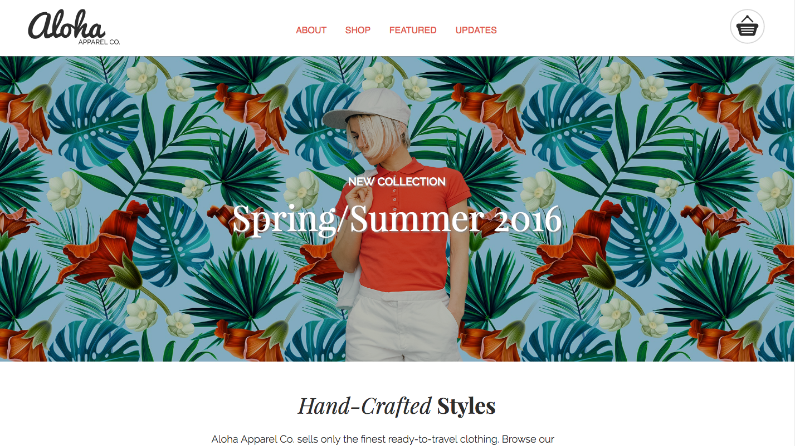

# Aloha_project_part2

This is the second part of Project 1, it is level-up the Aloha Apparel Co. website by adding interactivity with JS.

# Goal Point 
* add a navigation menu to the header 
* a new section to the page that showcases the different types of apparel products that Aloha sells
* responsive (optimize the website for the three screen sizes: moblie, tablet, desktop)

<!-- #Learning point
 -->