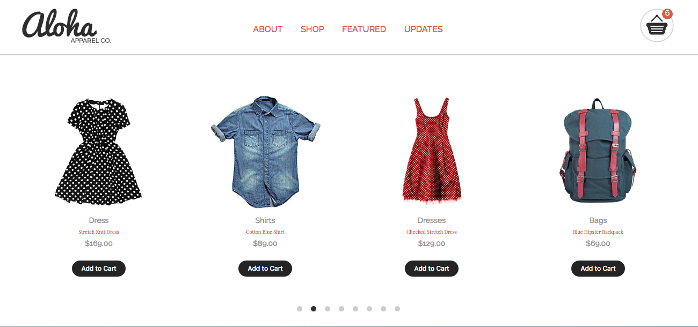

# Aloha Apparel Co

This is a responsive website for the client: the Aloha Apparel Co. The website build with HTML, CSS components, and interactive JS.

## Goal Point

* Responsive (optimize the website for the three screen sizes: moblie, tablet, desktop)
* Use the HTML5 doctype and semantic HTML5 mark-up
* Pushed to GitHub
* Make appropriate use of paragraph, heading, and list elements
* Update the the cart icon in the top-right corner of the header every time the user clicks the “Add to Cart” button for a product

